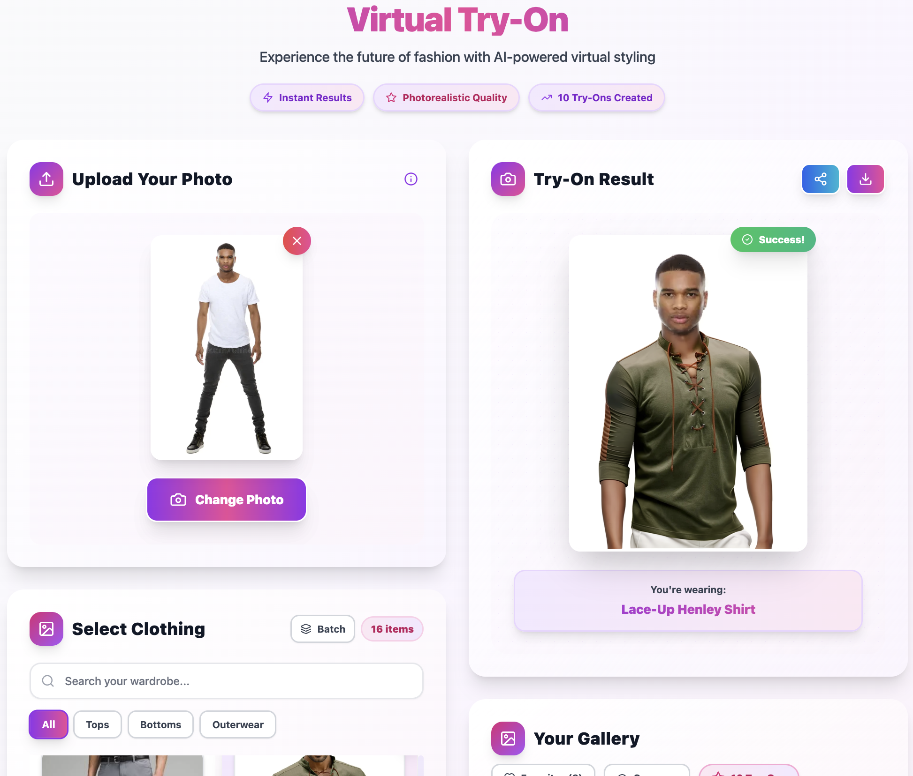
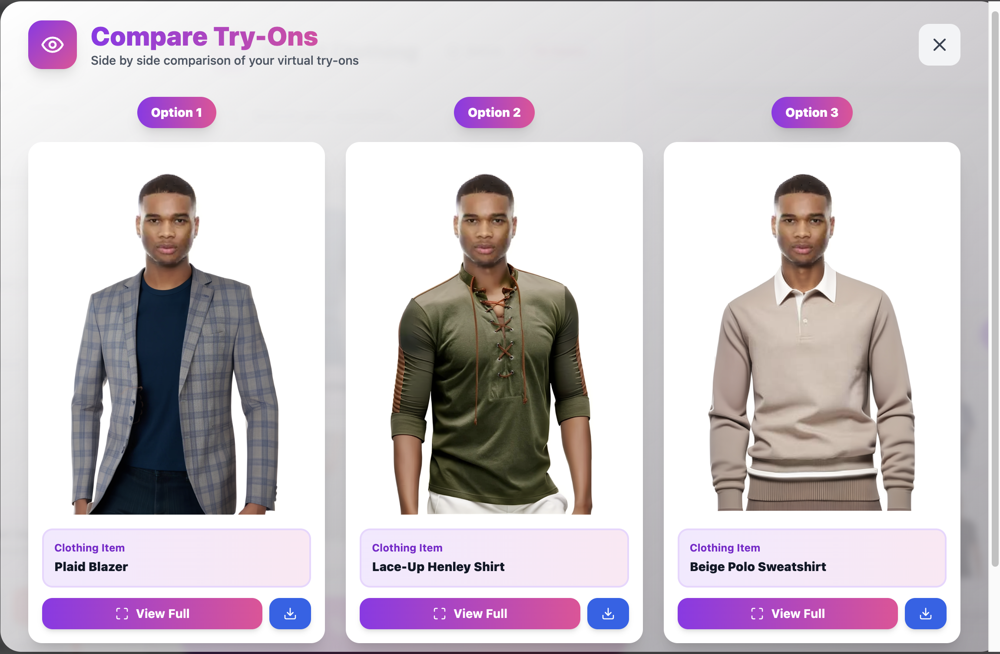
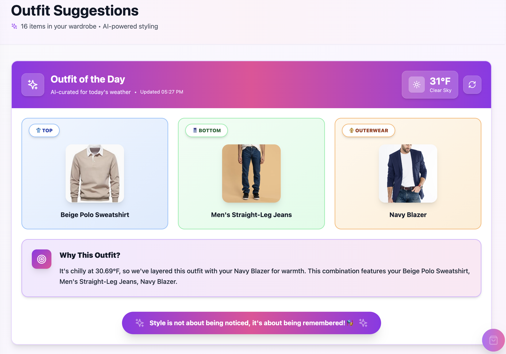
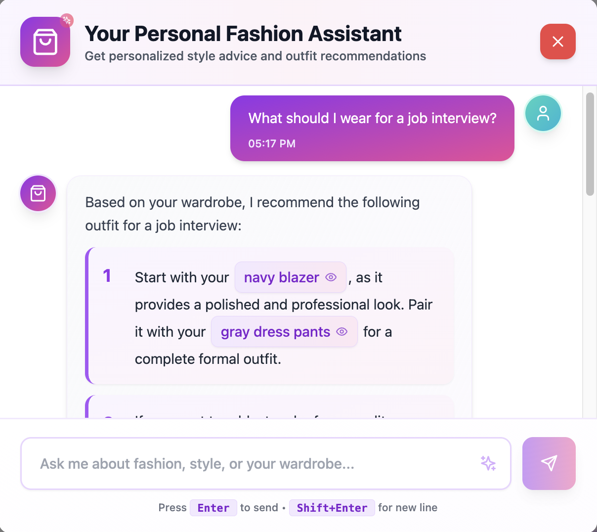
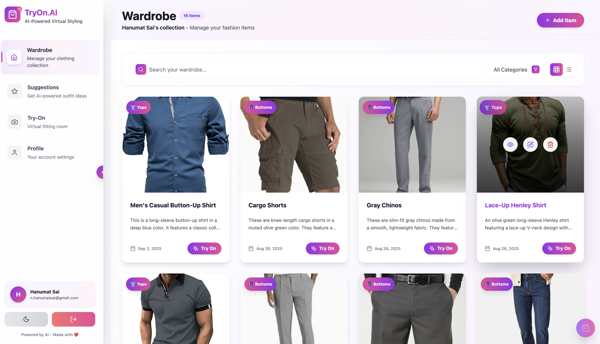

# TryOn.AI — Virtual Styling Platform

<div align="center">

**Upload a photo. Pick any item from your wardrobe. See yourself wearing it.**

[](https://try-on-ai-pi.vercel.app)

[](https://reactjs.org/)
[](https://www.typescriptlang.org/)
[](https://tailwindcss.com/)
[](https://fastapi.tiangolo.com/)
[](https://choosealicense.com/licenses/mit/)

</div>

---

## What it does

TryOn.AI lets you build a digital wardrobe and virtually try on your clothes using AI. Upload a photo of yourself, select any item from your collection, and the AI generates a realistic try-on result. You can also compare multiple outfits side-by-side, get daily outfit suggestions based on the actual weather, and chat with an AI stylist that recommends looks from your own wardrobe.

---

## Screenshots

<div align="center">

### Virtual Try-On


---

| Compare Multiple Outfits | Weather-Based Suggestions |
|:---:|:---:|
|  |  |

| AI Fashion Stylist | Your Digital Wardrobe |
|:---:|:---:|
|  |  |

</div>

---

## Features

**Virtual Try-On**
- AI-powered try-on from a single photo
- Batch mode — try on multiple items in one go
- Side-by-side comparison view
- Save favorites and build a try-on gallery

**Digital Wardrobe**
- Upload clothing items and AI auto-generates descriptions
- Filter and search by category (Tops, Bottoms, Outerwear, etc.)
- Clean visual grid layout

**AI Stylist Chat**
- Ask questions in plain English — "what should I wear to a job interview?"
- Recommendations pull from your actual wardrobe items
- Context-aware: knows your clothes, not generic suggestions

**Outfit Suggestions**
- Daily outfit picked based on real-time weather
- Mix and match combinations from your wardrobe
- Explains *why* it chose that outfit

**User Profile**
- Progress tracking and activity timeline
- Achievement badges
- Dark/Light mode

---

## Tech Stack

| Layer | Technology |
|---|---|
| Frontend | React 18, TypeScript, Vite, Tailwind CSS |
| Backend | FastAPI, Python 3.9+ |
| Database | Supabase (PostgreSQL + Storage + Auth) |
| AI | OpenAI GPT-4 Vision, LangChain, ChromaDB |
| Try-On API | RapidAPI |
| Weather | OpenWeatherMap API |
| Deployment | Vercel (frontend) + Google Cloud Run (backend) |

---

## Running Locally

### 1. Clone

```bash
git clone https://github.com/HanumatNarra/TryOn-AI.git
cd TryOn-AI
```

### 2. Backend

```bash
python -m venv venv
source venv/bin/activate  # Windows: venv\Scripts\activate
pip install -r requirements.txt
cp .env.example .env
# Fill in your API keys in .env
uvicorn main:app --reload --port 8001
```

### 3. Frontend

```bash
cd frontend
npm install
cp .env.example .env
# Fill in your Supabase + backend URL
npm run dev
```

### 4. Database

1. Create a Supabase project
2. Run migrations from `supabase/migrations/`
3. Create storage buckets for images
4. Enable Row Level Security (RLS)

---

## Environment Variables

**Backend `.env`**
```env
ENVIRONMENT=development
SUPABASE_URL=your_supabase_url
SUPABASE_SERVICE_KEY=your_service_key
OPENAI_API_KEY=your_openai_key
WEATHER_API_KEY=your_openweathermap_key
RAPIDAPI_KEY=your_rapidapi_key
ALLOWED_ORIGINS=http://localhost:3000,http://localhost:5173
```

**Frontend `.env`**
```env
VITE_SUPABASE_URL=your_supabase_url
VITE_SUPABASE_ANON_KEY=your_anon_key
VITE_BACKEND_URL=http://localhost:8001
```

---

## Deployment

**Frontend** — deployed on Vercel, auto-deploys on push to `main`.

**Backend** — containerized with Docker, running on Google Cloud Run.

```bash
# Deploy backend
bash deploy.sh
```

A `/keepalive` endpoint is called on a cron schedule to prevent Supabase free-tier from auto-pausing.

---

## License

MIT — see [LICENSE](LICENSE) for details.
